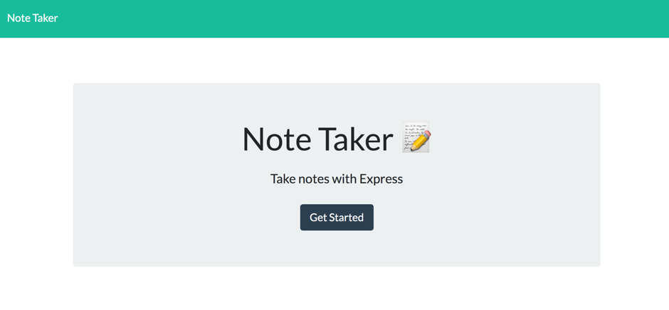
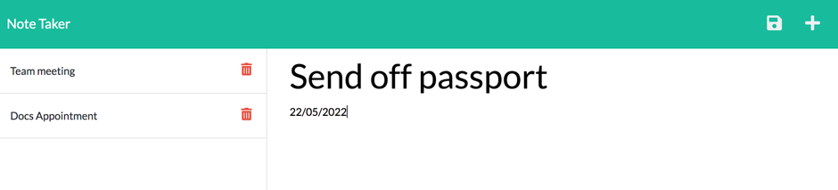

# Note-Taker App using ExpressJS 

## Table of Contents

- [Deployed Heroku Link](#deployed-heroku-link)
- [Description](#description)
- [Installation](#installation)
- [Usage](#usage)
- [User Journey](#user-journey)
- [Questions](#questions)
- [Screenshots](#screenshots)

## Deployed Heroku Link

Click here to view the webpage: https://morning-oasis-11546.herokuapp.com/

## Description

This application allows a user to make, store and delete notes. This application uses NodeJs and ExpressJS.

## Installation

```
git clone git@github.com:sophia4422/note-taker.git
cd note-taker
code .
```

Open the terminal and type:

```
npm install
```

## Usage

In the terminal type:

```
npm run start
```

## User Journey

```
WHEN I am prompted for my team members and their information
THEN an HTML file is generated that displays a nicely formatted team roster based on user input
WHEN I click on an email address in the HTML
THEN my default email program opens and populates the TO field of the email with the address
WHEN I click on the GitHub username
THEN that GitHub profile opens in a new tab
WHEN I start the application
THEN I am prompted to enter the team manager’s name, employee ID, email address, and office number
WHEN I enter the team manager’s name, employee ID, email address, and office number
THEN I am presented with a menu with the option to add an engineer or an intern or to finish building my team
WHEN I select the engineer option
THEN I am prompted to enter the engineer’s name, ID, email, and GitHub username, and I am taken back to the menu
WHEN I select the intern option
THEN I am prompted to enter the intern’s name, ID, email, and school, and I am taken back to the menu
WHEN I decide to finish building my team
THEN I exit the application, and the HTML is generated
```

## Questions

If you have any questions, please contact me via email: sophiapwall@yahoo.co.uk
My Github profile is [here](https://github.com/sophia4422)

## Screenshots

Screenshot of home page:


Screenshot of note page:

